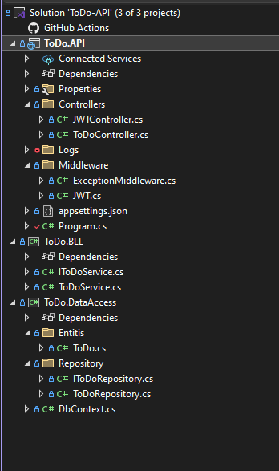

## Asp.net core web API

`Creat core web API`

`creat BLL project (business logic layer)`

`creat data accsess project`

<br>


- **Ref  :**

`BLL --> Data accsess`

`api --> Bll`

<br>

> Note : ctrl + shift + v ( Use to add new item )
> 
> Data/(product.cs,appdbcontect.cs)

```c#
1- on data accsess
2- on bll
3- on program.cs
4- on api
```

<br>




